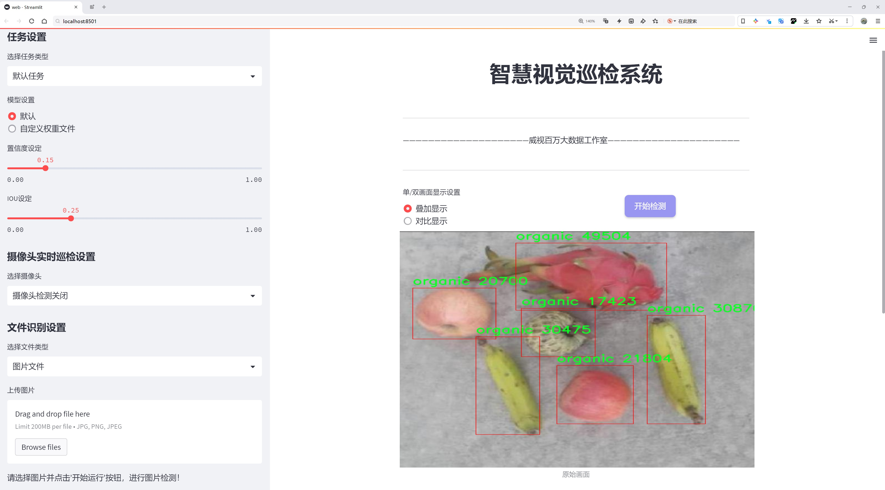
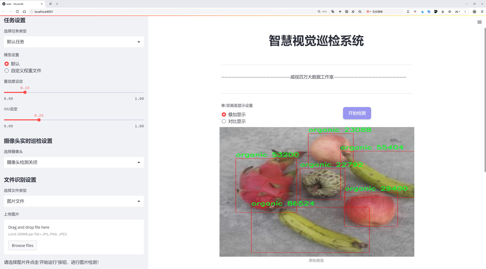
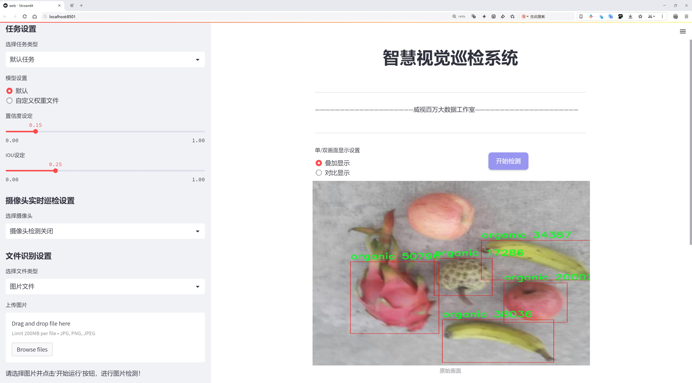
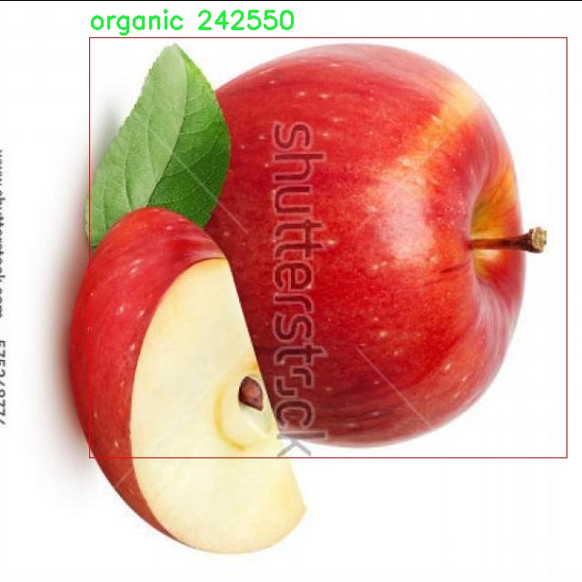
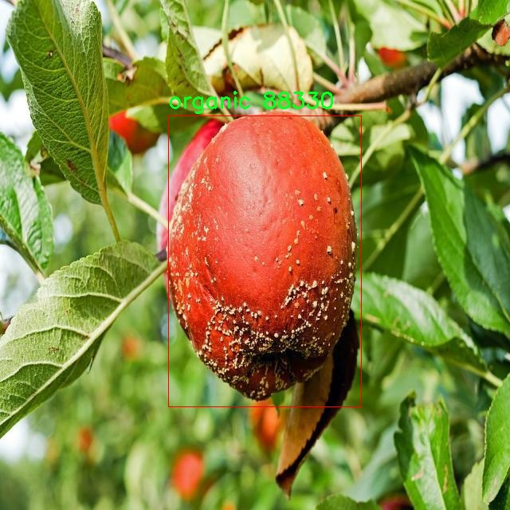
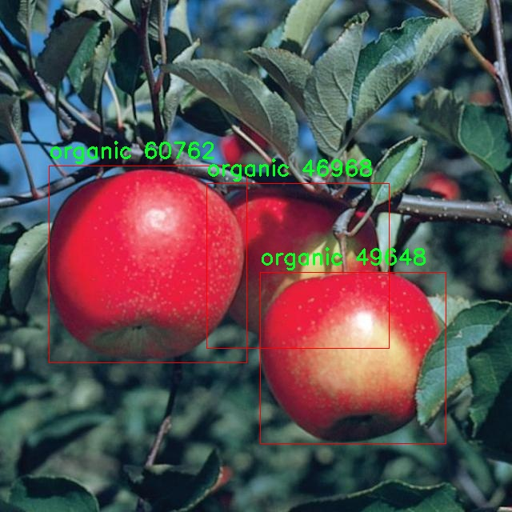
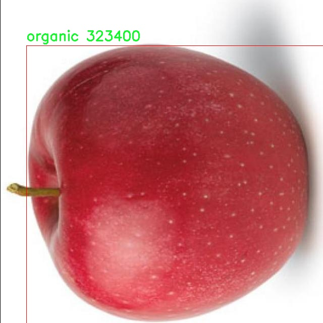
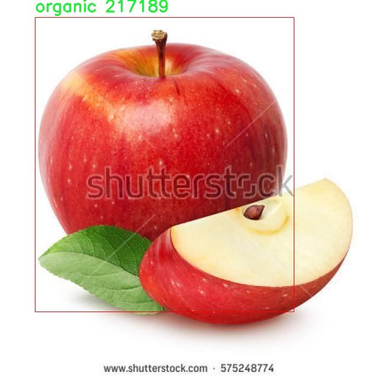

# 有机水果蔬菜检测检测系统源码分享
 # [一条龙教学YOLOV8标注好的数据集一键训练_70+全套改进创新点发刊_Web前端展示]

### 1.研究背景与意义

项目参考[AAAI Association for the Advancement of Artificial Intelligence](https://gitee.com/qunshansj/projects)

项目来源[AACV Association for the Advancement of Computer Vision](https://gitee.com/qunmasj/projects)

研究背景与意义

随着全球对健康饮食和可持续农业的关注日益增强，有机水果和蔬菜的消费需求显著上升。消费者不仅关注食品的营养价值，更加重视其来源和生产方式，这使得有机产品在市场上愈发受到青睐。然而，市场上有机产品的标识和分类常常存在混乱，导致消费者在选择时面临困惑。为了解决这一问题，开发一个高效、准确的有机水果蔬菜检测系统显得尤为重要。基于此背景，本文提出了一种改进的YOLOv8模型，用于有机水果和蔬菜的自动检测与分类。

YOLO（You Only Look Once）系列模型因其快速的检测速度和较高的准确率而广泛应用于物体检测领域。YOLOv8作为该系列的最新版本，具备了更强的特征提取能力和更高的检测精度。通过对YOLOv8模型的改进，我们可以更好地适应有机水果和蔬菜的检测需求。具体而言，改进的YOLOv8模型将结合深度学习技术，利用丰富的图像数据集进行训练，以实现对有机水果和蔬菜的高效识别。

本研究所使用的数据集包含7913张图像，专注于有机类别的水果和蔬菜。这一数据集的规模和多样性为模型的训练提供了坚实的基础，使得检测系统能够在不同的环境和条件下保持良好的性能。通过对这一数据集的深入分析和处理，我们可以提取出有机水果和蔬菜的特征，从而提升模型的识别能力。此外，数据集中单一的类别设置也使得模型在特定任务上的优化更加集中，有助于提高检测的准确性。

有机水果和蔬菜检测系统的开发不仅具有学术研究的价值，更在实际应用中展现出广泛的意义。首先，该系统能够为消费者提供更为可靠的有机产品识别工具，帮助他们在购买时做出更明智的选择。其次，随着有机农业的发展，农产品的溯源和质量控制成为重要议题。通过自动化的检测系统，生产者和监管机构能够更有效地监控有机产品的市场流通，确保其符合有机标准。此外，该系统还可以为相关企业提供数据支持，帮助他们优化供应链管理，提高运营效率。

综上所述，基于改进YOLOv8的有机水果蔬菜检测系统的研究，不仅为物体检测技术的发展提供了新的思路，也为促进有机农业的可持续发展贡献了力量。通过实现高效、准确的有机产品检测，我们期待能够在推动消费者健康饮食的同时，助力有机农业的规范化和标准化进程。

### 2.图片演示







##### 注意：由于此博客编辑较早，上面“2.图片演示”和“3.视频演示”展示的系统图片或者视频可能为老版本，新版本在老版本的基础上升级如下：（实际效果以升级的新版本为准）

  （1）适配了YOLOV8的“目标检测”模型和“实例分割”模型，通过加载相应的权重（.pt）文件即可自适应加载模型。

  （2）支持“图片识别”、“视频识别”、“摄像头实时识别”三种识别模式。

  （3）支持“图片识别”、“视频识别”、“摄像头实时识别”三种识别结果保存导出，解决手动导出（容易卡顿出现爆内存）存在的问题，识别完自动保存结果并导出到tempDir中。

  （4）支持Web前端系统中的标题、背景图等自定义修改，后面提供修改教程。

  另外本项目提供训练的数据集和训练教程,暂不提供权重文件（best.pt）,需要您按照教程进行训练后实现图片演示和Web前端界面演示的效果。

### 3.视频演示

[3.1 视频演示](https://www.bilibili.com/video/BV1mRtaeYEcY/)

### 4.数据集信息展示

##### 4.1 本项目数据集详细数据（类别数＆类别名）

nc: 1
names: ['organic']


##### 4.2 本项目数据集信息介绍

数据集信息展示

在现代农业与食品安全领域，利用计算机视觉技术进行有机水果和蔬菜的检测与分类，已成为提升生产效率和保障食品质量的重要手段。本研究所采用的数据集名为“fruits and vegies”，其专注于有机产品的识别与分类，旨在为改进YOLOv8的有机水果蔬菜检测系统提供高质量的训练数据。该数据集的设计充分考虑了有机水果和蔬菜的多样性与特征，通过精心收集和标注，确保其在实际应用中的有效性和可靠性。

“fruits and vegies”数据集包含了丰富的图像数据，所有样本均为有机水果和蔬菜，且数据集的类别数量为1，具体类别为“organic”。这一单一类别的设置，旨在突出有机产品的特征，使得模型在训练过程中能够更专注于识别与分类有机水果和蔬菜的独特属性。这种聚焦不仅提高了模型的学习效率，也增强了其在实际应用中的准确性和鲁棒性。

数据集中的图像来源广泛，涵盖了不同的有机水果和蔬菜品种，确保了样本的多样性与代表性。每张图像均经过严格的标注，确保其在训练过程中能够提供清晰、准确的特征信息。这些图像不仅包括了单一水果或蔬菜的特写，还涵盖了多种有机产品的组合场景，模拟了实际市场环境中的常见情况。这种多样化的图像内容，有助于模型学习到不同背景、光照条件和视角下的有机产品特征，从而提升其在复杂环境中的检测能力。

此外，数据集还考虑到了有机水果和蔬菜的生长阶段、成熟度和外观差异等因素，确保模型能够适应不同状态下的产品识别。这种细致的设计使得“fruits and vegies”数据集不仅具备了良好的训练基础，也为后续的模型优化和性能提升提供了坚实的保障。

在数据集的使用过程中，研究者们可以通过对“fruits and vegies”数据集的深入分析，提取出有机水果和蔬菜的关键特征，进而为YOLOv8模型的改进提供有力支持。通过不断迭代和优化，最终实现高效、准确的有机产品检测系统，为农业生产、食品安全及市场监管等领域提供重要的技术支撑。

总之，“fruits and vegies”数据集以其丰富的图像资源和明确的类别定义，为有机水果和蔬菜的检测与分类研究提供了重要的基础。随着YOLOv8模型的不断改进与应用，该数据集的价值将愈加凸显，为推动有机农业的发展与可持续食品系统的构建贡献力量。











### 5.全套项目环境部署视频教程（零基础手把手教学）

[5.1 环境部署教程链接（零基础手把手教学）](https://www.ixigua.com/7404473917358506534?logTag=c807d0cbc21c0ef59de5)


[5.2 安装Python虚拟环境创建和依赖库安装视频教程链接（零基础手把手教学）](https://www.ixigua.com/7404474678003106304?logTag=1f1041108cd1f708b01a)

### 6.手把手YOLOV8训练视频教程（零基础小白有手就能学会）

[6.1 手把手YOLOV8训练视频教程（零基础小白有手就能学会）](https://www.ixigua.com/7404477157818401292?logTag=d31a2dfd1983c9668658)

### 7.70+种全套YOLOV8创新点代码加载调参视频教程（一键加载写好的改进模型的配置文件）

[7.1 70+种全套YOLOV8创新点代码加载调参视频教程（一键加载写好的改进模型的配置文件）](https://www.ixigua.com/7404478314661806627?logTag=29066f8288e3f4eea3a4)

### 8.70+种全套YOLOV8创新点原理讲解（非科班也可以轻松写刊发刊，V10版本正在科研待更新）

由于篇幅限制，每个创新点的具体原理讲解就不一一展开，具体见下列网址中的创新点对应子项目的技术原理博客网址【Blog】：


[8.1 70+种全套YOLOV8创新点原理讲解链接](https://gitee.com/qunmasj/good)

### 9.系统功能展示（检测对象为举例，实际内容以本项目数据集为准）

图9.1.系统支持检测结果表格显示

  图9.2.系统支持置信度和IOU阈值手动调节

  图9.3.系统支持自定义加载权重文件best.pt(需要你通过步骤5中训练获得)

  图9.4.系统支持摄像头实时识别

  图9.5.系统支持图片识别

  图9.6.系统支持视频识别

  图9.7.系统支持识别结果文件自动保存

  图9.8.系统支持Excel导出检测结果数据


### 10.原始YOLOV8算法原理

原始YOLOv8算法原理

YOLOv8，作为2023年1月发布的最新一代目标检测模型，标志着计算机视觉领域的一次重要飞跃。它不仅在目标检测、分类和分割任务中展现出卓越的性能，还在精度和执行时间上超越了所有已知的模型。YOLOv8的设计理念源于其前辈YOLO系列模型，尤其是YOLOv5、YOLOv6和YOLOX等，综合了这些模型的优点，进一步优化了结构，提升了性能，同时保持了工程化的简洁性和易用性。

YOLOv8的核心创新在于其全新的骨干网络和检测头设计。与之前的YOLOv5相比，YOLOv8在卷积层的设计上进行了重要调整，首次将卷积核的大小从6x6缩小至3x3，这一变化不仅提高了特征提取的精度，也加快了计算速度。此外，YOLOv8采用了C2f模块替代了原有的C3模块，C2f模块通过增加跳层连接和Split操作，增强了网络的特征表达能力，同时简化了Neck模块的结构，使得信息传递更加高效。

在特征融合方面，YOLOv8引入了特征金字塔网络（FPN）和路径聚合网络（PAN），并在此基础上增加了BiFPN网络，以实现高效的双向跨尺度连接和加权特征融合。这种设计使得YOLOv8能够更好地处理不同尺度的特征信息，从而在小目标检测和高分辨率图像处理上表现出色。通过优化特征融合层，YOLOv8不仅提高了模型的检测精度，还减少了计算资源的消耗，展现出极高的工程实用性。

YOLOv8的检测头部分也经历了显著的变革。它从原有的耦合头转变为解耦头，并且采用了Anchor-Free的检测策略。这一变化使得YOLOv8不再依赖于传统的锚框机制，减少了模型的复杂性，同时提高了检测的灵活性和准确性。解耦头的设计使得分类和回归任务能够独立进行，从而在不同的任务上实现更高的性能。

在损失函数的设计上，YOLOv8也进行了创新，旨在提高模型在不同硬件平台上的适应性。新的损失函数通过优化目标检测的训练过程，使得模型在CPU和GPU等多种硬件环境下均能高效运行。这一特性不仅增强了YOLOv8的实用性，也为其在实际应用中的推广提供了便利。

值得一提的是，YOLOv8的轻量化版本YOLOv8n，特别适合资源受限的环境。YOLOv8n通过使用更轻量化的C2F模块，减少了模型的参数量和计算复杂度，使得在移动设备和边缘计算平台上运行成为可能。其特征融合网络的设计也经过精简，进一步提升了处理速度和效率。这种轻量化设计不仅保持了YOLOv8的高精度，还确保了在实时检测场景中的高效性。

YOLOv8的推出，不仅为目标检测领域带来了新的技术突破，也为实际应用提供了强大的支持。无论是在自动驾驶、安防监控，还是在工业自动化和智能家居等领域，YOLOv8都展现出了广泛的应用潜力。其高效的检测能力和优越的实时性能，使得它成为了许多实际应用中的首选模型。

综上所述，YOLOv8作为YOLO系列的最新版本，通过一系列创新和优化，成功实现了目标检测领域的重大进步。它的设计不仅继承了前辈模型的优点，还在此基础上进行了深度的改进，尤其是在骨干网络、特征融合和检测头的设计上，展现出了极高的灵活性和适应性。随着YOLOv8的广泛应用，未来的目标检测技术将迎来更加辉煌的前景。


### 11.项目核心源码讲解（再也不用担心看不懂代码逻辑）

#### 11.1 code\chinese_name_list.py

下面是对提供的代码进行逐行分析和注释后的核心部分：

```python
# -*- coding: utf-8 -*-  # 指定文件编码为UTF-8，以支持中文字符

# 创建一个字典，键为英文单词，值为对应的中文翻译
Chinese_name = {'person': "人"}

# 从字典中提取所有的中文翻译，生成一个列表
Label_list = list(Chinese_name.values())
```

### 代码分析：
1. **文件编码声明**：`# -*- coding: utf-8 -*-` 这一行是用来声明文件的编码格式为UTF-8，这样可以确保文件中的中文字符能够被正确识别和处理。

2. **字典创建**：`Chinese_name = {'person': "人"}` 这一行创建了一个字典，字典的键是英文单词`'person'`，值是其对应的中文翻译`"人"`。字典是一种用于存储键值对的数据结构，可以通过键快速查找对应的值。

3. **列表生成**：`Label_list = list(Chinese_name.values())` 这一行从字典`Chinese_name`中提取所有的值（即中文翻译），并将这些值转换为一个列表。`values()`方法返回字典中所有值的视图，而`list()`函数则将这个视图转换为一个列表。

### 核心部分总结：
- 字典`Chinese_name`用于存储英文与中文的对应关系。
- 列表`Label_list`用于存储字典中所有的中文翻译，方便后续使用。

这个文件的代码主要是定义了一个包含中文名称的字典和一个列表。首先，文件开头的 `# -*- coding: utf-8 -*-` 是一个编码声明，表明这个文件使用 UTF-8 编码，这对于处理中文字符是必要的。

接下来，定义了一个字典 `Chinese_name`，其中包含一个键值对，键是 `'person'`，值是 `"人"`。这个字典的目的是将英文单词与其对应的中文翻译进行关联。在这个例子中，`'person'` 被翻译为 `"人"`。

然后，使用 `list(Chinese_name.values())` 创建了一个列表 `Label_list`，这个列表包含了字典 `Chinese_name` 中所有的值。在这个特定的例子中，`Label_list` 将会是一个包含单一元素的列表，即 `["人"]`。

总体来说，这段代码的功能是将英文单词与中文翻译进行映射，并将所有的中文翻译存储在一个列表中，以便后续使用。

#### 11.2 ui.py

以下是代码中最核心的部分，并附上详细的中文注释：

```python
import sys
import subprocess

def run_script(script_path):
    """
    使用当前 Python 环境运行指定的脚本。

    Args:
        script_path (str): 要运行的脚本路径

    Returns:
        None
    """
    # 获取当前 Python 解释器的路径
    python_path = sys.executable

    # 构建运行命令，使用 streamlit 运行指定的脚本
    command = f'"{python_path}" -m streamlit run "{script_path}"'

    # 执行命令
    result = subprocess.run(command, shell=True)
    # 检查命令执行的返回码，如果不为0，表示执行出错
    if result.returncode != 0:
        print("脚本运行出错。")

# 实例化并运行应用
if __name__ == "__main__":
    # 指定要运行的脚本路径
    script_path = "web.py"  # 这里可以替换为实际的脚本路径

    # 调用函数运行脚本
    run_script(script_path)
```

### 代码说明：
1. **导入模块**：
   - `sys`：用于获取当前 Python 解释器的路径。
   - `subprocess`：用于执行外部命令。

2. **定义 `run_script` 函数**：
   - 该函数接收一个参数 `script_path`，表示要运行的 Python 脚本的路径。
   - 使用 `sys.executable` 获取当前 Python 解释器的路径，以确保使用相同的环境运行脚本。
   - 构建一个命令字符串，使用 `streamlit` 模块运行指定的脚本。
   - 使用 `subprocess.run` 执行构建的命令，并检查返回码以判断脚本是否成功运行。

3. **主程序入口**：
   - 在 `if __name__ == "__main__":` 块中，指定要运行的脚本路径，并调用 `run_script` 函数执行该脚本。

这个程序文件名为 `ui.py`，主要功能是使用当前的 Python 环境来运行一个指定的脚本，具体是一个名为 `web.py` 的文件。程序首先导入了必要的模块，包括 `sys`、`os` 和 `subprocess`，以及一个自定义的路径处理模块 `abs_path`。

在 `run_script` 函数中，首先获取当前 Python 解释器的路径，这通过 `sys.executable` 实现。接着，构建一个命令字符串，该命令用于调用 `streamlit` 模块并运行指定的脚本。这里使用了 Python 的 `subprocess.run` 方法来执行这个命令，并通过 `shell=True` 参数允许在 shell 中执行命令。

在执行命令后，程序检查返回的结果代码。如果返回代码不为零，表示脚本运行过程中出现了错误，程序会打印出“脚本运行出错”的提示信息。

在文件的最后部分，使用 `if __name__ == "__main__":` 语句来确保只有在直接运行该文件时才会执行下面的代码。这里指定了要运行的脚本路径 `web.py`，并调用 `run_script` 函数来执行这个脚本。

总的来说，这个程序的作用是方便地在当前 Python 环境中运行一个 Streamlit 应用脚本，并处理可能出现的错误。

#### 11.3 code\ultralytics\utils\dist.py

以下是代码中最核心的部分，并附上详细的中文注释：

```python
import os
import shutil
import socket
import sys
import tempfile

from . import USER_CONFIG_DIR
from .torch_utils import TORCH_1_9

def find_free_network_port() -> int:
    """
    查找本地主机上可用的端口。

    在单节点训练时，如果不想连接到真实的主节点，但必须设置
    `MASTER_PORT` 环境变量时，这个函数非常有用。
    """
    with socket.socket(socket.AF_INET, socket.SOCK_STREAM) as s:
        s.bind(("127.0.0.1", 0))  # 绑定到本地地址和随机端口
        return s.getsockname()[1]  # 返回绑定的端口号


def generate_ddp_file(trainer):
    """生成 DDP 文件并返回其文件名。"""
    # 获取训练器的模块和类名
    module, name = f"{trainer.__class__.__module__}.{trainer.__class__.__name__}".rsplit(".", 1)

    # 创建 DDP 文件的内容
    content = f"""
# Ultralytics 多 GPU 训练临时文件（使用后应自动删除）
overrides = {vars(trainer.args)}

if __name__ == "__main__":
    from {module} import {name}
    from ultralytics.utils import DEFAULT_CFG_DICT

    cfg = DEFAULT_CFG_DICT.copy()
    cfg.update(save_dir='')   # 处理额外的 'save_dir' 键
    trainer = {name}(cfg=cfg, overrides=overrides)
    results = trainer.train()
"""
    # 创建 DDP 目录（如果不存在）
    (USER_CONFIG_DIR / "DDP").mkdir(exist_ok=True)
    # 创建一个临时文件，写入内容
    with tempfile.NamedTemporaryFile(
        prefix="_temp_",
        suffix=f"{id(trainer)}.py",
        mode="w+",
        encoding="utf-8",
        dir=USER_CONFIG_DIR / "DDP",
        delete=False,
    ) as file:
        file.write(content)  # 将内容写入临时文件
    return file.name  # 返回临时文件的名称


def generate_ddp_command(world_size, trainer):
    """生成并返回分布式训练的命令。"""
    import __main__  # 本地导入以避免特定问题

    if not trainer.resume:
        shutil.rmtree(trainer.save_dir)  # 如果不恢复训练，删除保存目录
    file = generate_ddp_file(trainer)  # 生成 DDP 文件
    dist_cmd = "torch.distributed.run" if TORCH_1_9 else "torch.distributed.launch"  # 根据 PyTorch 版本选择命令
    port = find_free_network_port()  # 查找可用端口
    # 构建命令行参数
    cmd = [sys.executable, "-m", dist_cmd, "--nproc_per_node", f"{world_size}", "--master_port", f"{port}", file]
    return cmd, file  # 返回命令和文件名


def ddp_cleanup(trainer, file):
    """如果创建了临时文件，则删除它。"""
    if f"{id(trainer)}.py" in file:  # 检查临时文件后缀
        os.remove(file)  # 删除临时文件
```

### 代码核心部分说明：
1. **查找可用端口**：`find_free_network_port` 函数用于查找本地可用的网络端口，以便在分布式训练中使用。
2. **生成 DDP 文件**：`generate_ddp_file` 函数根据训练器的配置生成一个临时 Python 文件，该文件包含了训练的必要代码。
3. **生成分布式训练命令**：`generate_ddp_command` 函数生成执行分布式训练所需的命令，包括使用的 Python 解释器、分布式命令、进程数量和端口等信息。
4. **清理临时文件**：`ddp_cleanup` 函数用于在训练结束后删除生成的临时文件，以避免文件堆积。

这个程序文件主要用于支持Ultralytics YOLO模型的分布式训练，特别是在多GPU环境下。文件中包含了一些函数，这些函数的主要功能是处理网络端口的查找、生成分布式训练所需的临时文件，以及构建和清理分布式训练的命令。

首先，`find_free_network_port`函数用于查找本地主机上一个可用的网络端口。这个功能在单节点训练时非常有用，因为在这种情况下，我们不需要连接到一个真实的主节点，但仍然需要设置`MASTER_PORT`环境变量。该函数通过创建一个TCP套接字并将其绑定到本地地址来实现，绑定时指定端口为0，操作系统会自动分配一个可用的端口。

接下来，`generate_ddp_file`函数用于生成一个分布式数据并行（DDP）训练的临时文件，并返回该文件的名称。该函数首先获取训练器的类模块和名称，然后构建一个Python脚本的内容，该脚本包含了训练器的参数和训练逻辑。生成的脚本会被保存在用户配置目录下的"DDP"文件夹中，并且在创建文件时使用了临时文件的方式，以确保文件在使用后可以被删除。

`generate_ddp_command`函数用于生成分布式训练的命令。它首先检查训练器是否需要恢复训练，如果不需要，则会删除保存目录。然后调用`generate_ddp_file`生成临时文件，并根据PyTorch的版本选择合适的分布式运行命令（`torch.distributed.run`或`torch.distributed.launch`）。接着，它会调用`find_free_network_port`来获取一个可用的端口，并构建一个包含Python可执行文件、分布式命令、进程数和端口等信息的命令列表。

最后，`ddp_cleanup`函数用于在训练完成后清理临时文件。如果生成的临时文件的后缀与训练器的ID匹配，则会删除该文件，以确保不会留下多余的临时文件。

总体而言，这个文件为Ultralytics YOLO的分布式训练提供了必要的支持，确保训练过程中的配置和资源管理能够顺利进行。

#### 11.4 70+种YOLOv8算法改进源码大全和调试加载训练教程（非必要）\ultralytics\models\rtdetr\__init__.py

以下是代码中最核心的部分，并附上详细的中文注释：

```python
# 导入RTDETR模型、预测器和验证器
from .model import RTDETR  # 导入RTDETR模型类
from .predict import RTDETRPredictor  # 导入RTDETR预测器类
from .val import RTDETRValidator  # 导入RTDETR验证器类

# 定义模块的公开接口，包含可供外部使用的类
__all__ = 'RTDETRPredictor', 'RTDETRValidator', 'RTDETR'  # 指定模块导出哪些类
```

### 注释说明：
1. **导入模块**：
   - `from .model import RTDETR`：从当前包的`model`模块中导入`RTDETR`类，`RTDETR`是一个模型类，负责定义和构建YOLO（You Only Look Once）算法的网络结构。
   - `from .predict import RTDETRPredictor`：从当前包的`predict`模块中导入`RTDETRPredictor`类，`RTDETRPredictor`用于对输入数据进行预测，返回检测结果。
   - `from .val import RTDETRValidator`：从当前包的`val`模块中导入`RTDETRValidator`类，`RTDETRValidator`用于验证模型的性能，通常用于评估模型在测试集上的表现。

2. **定义公开接口**：
   - `__all__`：这是一个特殊变量，用于定义模块的公共接口。只有在使用`from module import *`时，列在`__all__`中的类和函数才会被导入。这里定义了`RTDETRPredictor`、`RTDETRValidator`和`RTDETR`为模块的公共部分，方便外部调用。

这个程序文件是Ultralytics YOLO项目的一部分，主要用于定义和导入与RTDETR（一个YOLO变体）相关的模块和类。文件开头的注释说明了该项目使用的是AGPL-3.0许可证，这意味着该代码是开源的，并且可以自由使用和修改，但在分发时需要遵循相应的许可证条款。

接下来的代码部分从当前包中导入了三个重要的组件：RTDETR、RTDETRPredictor和RTDETRValidator。RTDETR是模型的核心类，负责定义和实现RTDETR算法的结构和功能。RTDETRPredictor则是用于进行预测的类，通常包含处理输入数据并生成模型输出的逻辑。RTDETRValidator则用于验证模型的性能，通常涉及评估模型在测试集上的表现。

最后，`__all__`变量定义了该模块公开的接口，包含了RTDETRPredictor、RTDETRValidator和RTDETR这三个类。这意味着当使用`from module import *`语句时，只会导入这三个类，其他未列出的内容将不会被导入。这种做法有助于控制模块的公共接口，确保用户只访问到设计者希望公开的部分。整体来看，这个文件在RTDETR模型的实现和使用中起到了组织和管理模块的作用。

#### 11.5 train.py

以下是经过简化和注释的核心代码部分：

```python
import random
import numpy as np
import torch.nn as nn
from ultralytics.data import build_dataloader, build_yolo_dataset
from ultralytics.engine.trainer import BaseTrainer
from ultralytics.models import yolo
from ultralytics.nn.tasks import DetectionModel
from ultralytics.utils import LOGGER, RANK
from ultralytics.utils.torch_utils import de_parallel, torch_distributed_zero_first

class DetectionTrainer(BaseTrainer):
    """
    基于检测模型的训练类，继承自BaseTrainer类。
    """

    def build_dataset(self, img_path, mode="train", batch=None):
        """
        构建YOLO数据集。

        参数:
            img_path (str): 包含图像的文件夹路径。
            mode (str): 模式，`train`表示训练模式，`val`表示验证模式。
            batch (int, optional): 批量大小，适用于`rect`模式。默认为None。
        """
        gs = max(int(de_parallel(self.model).stride.max() if self.model else 0), 32)
        return build_yolo_dataset(self.args, img_path, batch, self.data, mode=mode, rect=mode == "val", stride=gs)

    def get_dataloader(self, dataset_path, batch_size=16, rank=0, mode="train"):
        """构造并返回数据加载器。"""
        assert mode in ["train", "val"]
        with torch_distributed_zero_first(rank):  # 在分布式环境中只初始化一次数据集
            dataset = self.build_dataset(dataset_path, mode, batch_size)
        shuffle = mode == "train"  # 训练模式下打乱数据
        workers = self.args.workers if mode == "train" else self.args.workers * 2
        return build_dataloader(dataset, batch_size, workers, shuffle, rank)  # 返回数据加载器

    def preprocess_batch(self, batch):
        """对一批图像进行预处理，包括缩放和转换为浮点数。"""
        batch["img"] = batch["img"].to(self.device, non_blocking=True).float() / 255  # 归一化图像
        if self.args.multi_scale:  # 如果启用多尺度
            imgs = batch["img"]
            sz = (
                random.randrange(self.args.imgsz * 0.5, self.args.imgsz * 1.5 + self.stride)
                // self.stride
                * self.stride
            )  # 随机选择尺寸
            sf = sz / max(imgs.shape[2:])  # 计算缩放因子
            if sf != 1:
                ns = [
                    math.ceil(x * sf / self.stride) * self.stride for x in imgs.shape[2:]
                ]  # 计算新的形状
                imgs = nn.functional.interpolate(imgs, size=ns, mode="bilinear", align_corners=False)  # 调整图像大小
            batch["img"] = imgs
        return batch

    def set_model_attributes(self):
        """设置模型的属性，包括类别数量和名称。"""
        self.model.nc = self.data["nc"]  # 将类别数量附加到模型
        self.model.names = self.data["names"]  # 将类别名称附加到模型
        self.model.args = self.args  # 将超参数附加到模型

    def get_model(self, cfg=None, weights=None, verbose=True):
        """返回YOLO检测模型。"""
        model = DetectionModel(cfg, nc=self.data["nc"], verbose=verbose and RANK == -1)
        if weights:
            model.load(weights)  # 加载权重
        return model

    def plot_training_samples(self, batch, ni):
        """绘制带有注释的训练样本。"""
        plot_images(
            images=batch["img"],
            batch_idx=batch["batch_idx"],
            cls=batch["cls"].squeeze(-1),
            bboxes=batch["bboxes"],
            paths=batch["im_file"],
            fname=self.save_dir / f"train_batch{ni}.jpg",
            on_plot=self.on_plot,
        )
```

### 代码说明：
1. **导入必要的库**：导入了用于数据处理、模型构建和训练的库。
2. **DetectionTrainer类**：这是一个继承自`BaseTrainer`的类，专门用于YOLO模型的训练。
3. **build_dataset方法**：构建YOLO数据集，接受图像路径、模式和批量大小作为参数。
4. **get_dataloader方法**：构造数据加载器，支持训练和验证模式，并处理数据集的初始化。
5. **preprocess_batch方法**：对输入的图像批次进行预处理，包括归一化和可选的多尺度调整。
6. **set_model_attributes方法**：设置模型的类别数量和名称，以便于训练时使用。
7. **get_model方法**：返回一个YOLO检测模型，并可选择加载预训练权重。
8. **plot_training_samples方法**：绘制训练样本及其注释，便于可视化训练过程。

这个程序文件 `train.py` 是一个用于训练 YOLO（You Only Look Once）目标检测模型的脚本，基于 Ultralytics 提供的框架。文件中定义了一个名为 `DetectionTrainer` 的类，继承自 `BaseTrainer`，专门用于处理目标检测任务。

在类的构造函数中，程序首先定义了一些用于构建数据集和数据加载器的方法。`build_dataset` 方法负责根据给定的图像路径和模式（训练或验证）构建 YOLO 数据集，并可以根据需要应用不同的数据增强策略。`get_dataloader` 方法则构建并返回数据加载器，确保在分布式训练时只初始化一次数据集，并处理数据加载的多线程设置。

接下来，`preprocess_batch` 方法用于对输入的图像批次进行预处理，包括将图像缩放到适当的大小并转换为浮点数格式。这个过程还考虑了多尺度训练的需求，通过随机选择图像大小来增强模型的鲁棒性。

`set_model_attributes` 方法用于设置模型的属性，包括类别数量和类别名称等信息，这些信息是从数据集中提取的。`get_model` 方法则用于返回一个 YOLO 检测模型的实例，可以选择加载预训练权重。

在验证阶段，`get_validator` 方法返回一个用于模型验证的 `DetectionValidator` 实例，能够计算并记录损失值。`label_loss_items` 方法用于返回一个包含训练损失项的字典，以便于后续的监控和分析。

为了跟踪训练进度，`progress_string` 方法生成一个格式化的字符串，显示当前的训练轮次、GPU 内存使用情况、损失值、实例数量和图像大小等信息。

此外，程序还提供了一些可视化功能，包括 `plot_training_samples` 方法用于绘制训练样本及其标注，`plot_metrics` 方法用于从 CSV 文件中绘制训练指标，`plot_training_labels` 方法则用于创建带有标签的训练图像，帮助用户更好地理解模型的训练过程。

总的来说，这个文件提供了一个完整的框架，涵盖了从数据准备、模型构建到训练和验证的各个方面，使得用户能够方便地进行 YOLO 模型的训练和评估。

#### 11.6 code\ultralytics\models\yolo\detect\train.py

以下是经过简化并添加详细中文注释的核心代码部分：

```python
import random
import numpy as np
import torch.nn as nn
from ultralytics.data import build_dataloader, build_yolo_dataset
from ultralytics.engine.trainer import BaseTrainer
from ultralytics.models import yolo
from ultralytics.nn.tasks import DetectionModel
from ultralytics.utils import LOGGER, RANK
from ultralytics.utils.torch_utils import de_parallel, torch_distributed_zero_first

class DetectionTrainer(BaseTrainer):
    """
    扩展自 BaseTrainer 类的检测模型训练类。
    """

    def build_dataset(self, img_path, mode="train", batch=None):
        """
        构建 YOLO 数据集。

        参数:
            img_path (str): 包含图像的文件夹路径。
            mode (str): 模式，`train` 或 `val`，用户可以为每种模式自定义不同的增强。
            batch (int, optional): 批次大小，仅用于 `rect` 模式。默认为 None。
        """
        gs = max(int(de_parallel(self.model).stride.max() if self.model else 0), 32)
        return build_yolo_dataset(self.args, img_path, batch, self.data, mode=mode, rect=mode == "val", stride=gs)

    def get_dataloader(self, dataset_path, batch_size=16, rank=0, mode="train"):
        """构造并返回数据加载器。"""
        assert mode in ["train", "val"]
        with torch_distributed_zero_first(rank):  # 在 DDP 模式下仅初始化数据集 *.cache 一次
            dataset = self.build_dataset(dataset_path, mode, batch_size)
        shuffle = mode == "train"  # 训练模式下打乱数据
        workers = self.args.workers if mode == "train" else self.args.workers * 2
        return build_dataloader(dataset, batch_size, workers, shuffle, rank)  # 返回数据加载器

    def preprocess_batch(self, batch):
        """对一批图像进行预处理，包括缩放和转换为浮点数。"""
        batch["img"] = batch["img"].to(self.device, non_blocking=True).float() / 255  # 将图像转换为浮点数并归一化
        if self.args.multi_scale:  # 如果启用多尺度
            imgs = batch["img"]
            sz = (
                random.randrange(self.args.imgsz * 0.5, self.args.imgsz * 1.5 + self.stride)
                // self.stride
                * self.stride
            )  # 随机选择图像大小
            sf = sz / max(imgs.shape[2:])  # 计算缩放因子
            if sf != 1:
                ns = [
                    math.ceil(x * sf / self.stride) * self.stride for x in imgs.shape[2:]
                ]  # 计算新的形状
                imgs = nn.functional.interpolate(imgs, size=ns, mode="bilinear", align_corners=False)  # 进行插值
            batch["img"] = imgs
        return batch

    def get_model(self, cfg=None, weights=None, verbose=True):
        """返回 YOLO 检测模型。"""
        model = DetectionModel(cfg, nc=self.data["nc"], verbose=verbose and RANK == -1)  # 创建检测模型
        if weights:
            model.load(weights)  # 加载权重
        return model

    def plot_training_samples(self, batch, ni):
        """绘制带有注释的训练样本。"""
        plot_images(
            images=batch["img"],
            batch_idx=batch["batch_idx"],
            cls=batch["cls"].squeeze(-1),
            bboxes=batch["bboxes"],
            paths=batch["im_file"],
            fname=self.save_dir / f"train_batch{ni}.jpg",
            on_plot=self.on_plot,
        )
```

### 代码说明：
1. **DetectionTrainer 类**：该类用于训练 YOLO 检测模型，继承自 `BaseTrainer`。
2. **build_dataset 方法**：构建 YOLO 数据集，支持训练和验证模式。
3. **get_dataloader 方法**：构造数据加载器，支持多进程加载和数据打乱。
4. **preprocess_batch 方法**：对输入的图像批次进行预处理，包括归一化和缩放。
5. **get_model 方法**：创建并返回一个 YOLO 检测模型，可以选择加载预训练权重。
6. **plot_training_samples 方法**：绘制训练样本及其对应的标注，便于可视化训练过程。

以上是代码的核心部分及其详细注释，便于理解 YOLO 模型的训练过程。

这个程序文件是Ultralytics YOLO模型的训练模块，主要用于训练目标检测模型。文件中首先导入了一些必要的库和模块，包括数学运算、随机数生成、深度学习框架PyTorch的神经网络模块、数据处理和模型构建的工具等。

程序定义了一个名为`DetectionTrainer`的类，该类继承自`BaseTrainer`，专门用于基于YOLO模型的目标检测训练。类中包含多个方法，具体功能如下：

`build_dataset`方法用于构建YOLO数据集，接收图像路径、模式（训练或验证）和批量大小作为参数。该方法会根据模型的步幅计算出合适的尺寸，并调用`build_yolo_dataset`函数来生成数据集。

`get_dataloader`方法用于构建数据加载器，确保在分布式训练时只初始化一次数据集。它根据训练或验证模式设置数据集的打乱方式，并根据参数设置返回数据加载器。

`preprocess_batch`方法负责对输入的图像批次进行预处理，包括将图像缩放到合适的大小并转换为浮点数格式。它还支持多尺度训练，通过随机选择图像尺寸来增强模型的鲁棒性。

`set_model_attributes`方法用于设置模型的属性，包括类别数量和类别名称，以便模型能够正确处理不同的目标类别。

`get_model`方法用于返回一个YOLO检测模型，可以选择加载预训练权重。

`get_validator`方法返回一个用于验证YOLO模型的验证器，记录损失名称并设置保存目录。

`label_loss_items`方法用于返回带有标签的训练损失项字典，方便监控训练过程中的损失变化。

`progress_string`方法返回一个格式化的字符串，显示训练进度，包括当前的epoch、GPU内存使用情况、损失值、实例数量和图像大小等信息。

`plot_training_samples`方法用于绘制训练样本及其标注，便于可视化训练数据的效果。

`plot_metrics`方法用于从CSV文件中绘制训练指标，生成训练过程中的性能图。

`plot_training_labels`方法用于创建标注的训练图，展示训练集中所有的边界框和类别信息，帮助分析模型的标注效果。

总体来说，这个文件提供了一个完整的框架，用于训练YOLO目标检测模型，涵盖了数据集构建、数据加载、模型设置、训练过程监控和结果可视化等多个方面。

### 12.系统整体结构（节选）

### 整体功能和构架概括

该项目是一个基于Ultralytics YOLO（You Only Look Once）框架的目标检测系统，旨在提供一个灵活且高效的训练和推理环境。项目的核心功能包括模型的训练、验证、数据处理和可视化。通过不同的模块，用户可以方便地构建数据集、设置模型参数、进行训练和评估，并对训练过程进行监控和分析。

项目的整体架构分为几个主要部分：

1. **数据处理**：包括数据集的构建、数据增强和数据加载等功能，确保训练数据的质量和多样性。
2. **模型训练**：提供了训练模型的类和方法，支持多种训练策略和参数设置。
3. **模型验证**：实现了验证过程中的性能评估，确保模型在测试集上的表现。
4. **可视化工具**：提供了可视化训练样本、损失值和指标的功能，帮助用户更好地理解模型的训练过程。
5. **分布式训练支持**：支持在多GPU环境下进行训练，提高训练效率。

### 文件功能整理表

| 文件路径                                                                                       | 功能描述                                                         |
|------------------------------------------------------------------------------------------------|------------------------------------------------------------------|
| `code\chinese_name_list.py`                                                                    | 定义中文名称的字典和列表，用于名称映射。                         |
| `ui.py`                                                                                       | 提供一个界面来运行指定的Streamlit脚本，处理训练过程中的命令。   |
| `code\ultralytics\utils\dist.py`                                                              | 支持分布式训练，处理网络端口查找和临时文件生成。                 |
| `70+种YOLOv8算法改进源码大全和调试加载训练教程（非必要）\ultralytics\models\rtdetr\__init__.py` | 定义RTDETR模型的模块，导入相关类和函数。                         |
| `train.py`                                                                                    | 训练YOLO目标检测模型的主脚本，处理数据集构建、模型训练等。      |
| `code\ultralytics\models\yolo\detect\train.py`                                               | YOLO目标检测模型的训练模块，包含数据处理、模型设置和训练监控。  |
| `70+种YOLOv8算法改进源码大全和调试加载训练教程（非必要）\ultralytics\utils\errors.py`         | 定义错误处理和异常管理的工具函数。                               |
| `70+种YOLOv8算法改进源码大全和调试加载训练教程（非必要）\ultralytics\utils\tal.py`          | 提供与训练相关的辅助函数，可能涉及训练日志和监控。               |
| `70+种YOLOv8算法改进源码大全和调试加载训练教程（非必要）\ultralytics\data\dataset.py`       | 定义数据集类，处理数据加载和预处理。                             |
| `code\ultralytics\models\yolo\detect\val.py`                                                 | 验证YOLO模型的模块，处理模型评估和性能计算。                     |
| `70+种YOLOv8算法改进源码大全和调试加载训练教程（非必要）\ultralytics\engine\predictor.py`   | 定义模型推理的预测器，处理输入数据并生成模型输出。               |
| `70+种YOLOv8算法改进源码大全和调试加载训练教程（非必要）\ultralytics\models\nas\val.py`     | 针对NAS（神经架构搜索）模型的验证模块，处理特定模型的评估。      |
| `70+种YOLOv8算法改进源码大全和调试加载训练教程（非必要）\ultralytics\data\augment.py`      | 定义数据增强策略，提升训练数据的多样性和模型的鲁棒性。          |

以上表格总结了项目中各个文件的主要功能，便于理解项目的整体结构和各个模块的作用。

注意：由于此博客编辑较早，上面“11.项目核心源码讲解（再也不用担心看不懂代码逻辑）”中部分代码可能会优化升级，仅供参考学习，完整“训练源码”、“Web前端界面”和“70+种创新点源码”以“13.完整训练+Web前端界面+70+种创新点源码、数据集获取”的内容为准。

### 13.完整训练+Web前端界面+70+种创新点源码、数据集获取


# [下载链接：https://mbd.pub/o/bread/ZpuWlJ5t](https://mbd.pub/o/bread/ZpuWlJ5t)